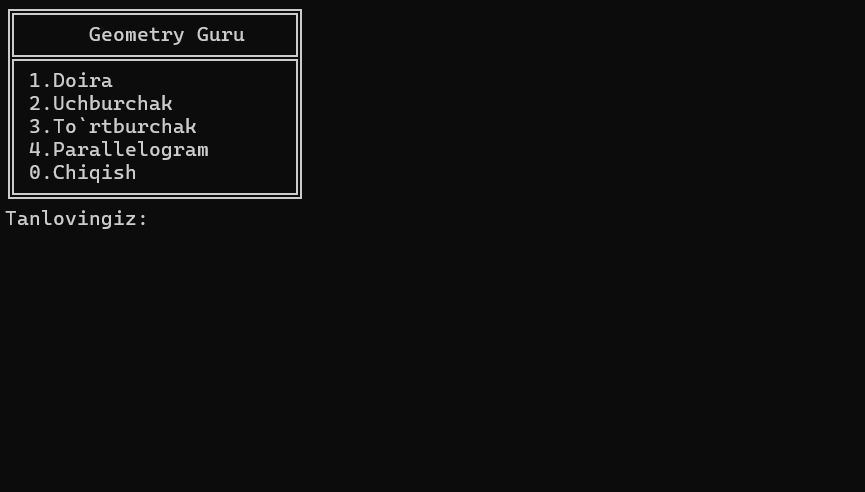

# 📐 Geometry Guru

**Geometry Guru** — bu interaktiv C# konsol dasturi bo'lib, foydalanuvchilarga turli geometrik shakllarning yuzasini hisoblash imkonini beradi. Dastur konsol menyusi orqali ishlaydi va doira, uchburchak, to'rtburchak hamda parallelogram yuzalarini aniq hisoblaydi.

---

## 🎬 Demo



*Dasturning ishlash jarayoni va interaktiv menyusini ko'rishingiz mumkin*

---

## ✨ Asosiy Imkoniyatlar

### Qo'llab-quvvatlanadigan Shakllar

- **🔘 Doira (Circle)** — Radius asosida yuza hisoblash
- **🔺 Uchburchak (Triangle)** — Ikki xil rejim:
  - 2 tomon berilganda uchinchi tomonning mumkin bo'lgan oralig'ini aniqlash
  - 3 tomon berilganda aniq yuza hisoblash (Geron formulasi)
- **▭ To'rtburchak (Rectangle)** — Uzunlik va kenglik asosida yuza hisoblash
- **⬛ Parallelogram** — Asos va balandlik asosida yuza hisoblash

### Qo'shimcha Xususiyatlar

- Intuitiv va tushunarli konsol interfeysi
- ASCII stilidagi professional menyu dizayni
- Kiritilgan ma'lumotlarni tekshirish va validatsiya
- Takroriy hisoblash imkoniyati
- Geometrik qoidalarga mos keluvchilikni tekshirish

---

## 🚀 Ishga Tushirish

### Talablar

- .NET SDK 6.0 yoki undan yuqori versiya
- Windows, macOS yoki Linux operatsion tizimi

### Ishlatish Qo'llanmasi

1. **Dasturni ishga tushiring**

   Dastur ishga tushirilganda quyidagi menyu paydo bo'ladi:

   ```
   ╔═══════════════════════════╗
   ║    Geometry Guru 📐       ║
   ╠═══════════════════════════╣
   ║  1. 🔘 Doira              ║
   ║  2. 🔺 Uchburchak         ║
   ║  3. ▭ To'rtburchak        ║
   ║  4. ⬛ Parallelogram      ║
   ║  0. ❌ Chiqish            ║
   ╚═══════════════════════════╝
   ```

2. **Shakl turini tanlang**

   Menyu raqamini kiriting (masalan, `1` - Doira uchun)

3. **Kerakli o'lchamlarni kiriting**

   Dastur sizdan zarur bo'lgan ma'lumotlarni so'raydi

4. **Natijani ko'ring**

   Hisoblangan yuza aniq formatda ekranga chiqariladi

5. **Davom ettirish yoki chiqish**

   Har bir hisoblashdan so'ng dastur sizdan qayta hisoblashni xohlash-xohlamasligingizni so'raydi

---

## 💡 Foydalanish Misollari

### 1️⃣ Doira Yuzasini Hisoblash

**Kod namunasi:**

```csharp
public void Circle(int radius)
{
    double area = radius * radius * Math.PI;
    Console.WriteLine($"Doira yuzasi: {radius} × {radius} × π = {area:F2}");
}
```

**Konsol natijasi:**

```
Tanlovingiz: 1
Doira radiusini kiriting: 5

Natija:
Doira yuzasi: 5 × 5 × π = 78.54
```

---

### 2️⃣ Uchburchak Yuzasini Hisoblash

**3 tomon berilganda:**

```csharp
public void Triangle(int a, int b, int c)
{
    // Uchburchak shartini tekshirish
    if (!(a + b > c && a + c > b && b + c > a))
    {
        Console.WriteLine("⚠️ Uchburchak bo'la olmaydi!");
        return;
    }
    
    // Geron formulasi
    double p = (a + b + c) / 2.0;
    double area = Math.Sqrt(p * (p - a) * (p - b) * (p - c));
    
    Console.WriteLine($"Uchburchak yuzasi: {area:F2}");
}
```

**Konsol natijasi:**

```
Tanlovingiz: 2
Uchburchakda nechta tomon kiritasiz? (2 yoki 3): 3

Birinchi tomon: 3
Ikkinchi tomon: 4
Uchinchi tomon: 5

Natija:
Uchburchak yuzasi: 6.00
```

**2 tomon berilganda:**

Dastur uchinchi tomonning mumkin bo'lgan qiymatlar oralig'ini ko'rsatadi:

```
Birinchi tomon: 5
Ikkinchi tomon: 7

Natija:
Uchinchi tomon oralig'i: 2 < c < 12
```

---

### 3️⃣ To'rtburchak Yuzasini Hisoblash

```csharp
public void Rectangle(int length, int width)
{
    int area = length * width;
    Console.WriteLine($"To'rtburchak yuzasi: {length} × {width} = {area}");
}
```

**Konsol natijasi:**

```
Tanlovingiz: 3
Uzunlikni kiriting: 8
Kenglikni kiriting: 5

Natija:
To'rtburchak yuzasi: 8 × 5 = 40
```

---

### 4️⃣ Parallelogram Yuzasini Hisoblash

```csharp
public void Parallelogram(int baseLength, int height)
{
    int area = baseLength * height;
    Console.WriteLine($"Parallelogram yuzasi: {baseLength} × {height} = {area}");
}
```

**Konsol natijasi:**

```
Tanlovingiz: 4
Asosni kiriting: 10
Balandlikni kiriting: 6

Natija:
Parallelogram yuzasi: 10 × 6 = 60
```

---

## 🛠️ Texnik Tafsilotlar

### Ishlatilgan Texnologiyalar

- **Dasturlash tili:** C#
- **Framework:** .NET 6.0+
- **Matematik operatsiyalar:** System.Math kutubxonasi

### Loyiha Tuzilishi

```
GeometryGuru/
│
├── Program.cs           # Asosiy dastur fayli
├── GeometryGuru.csproj  # Loyiha konfiguratsiyasi
└── README.md            # Hujjatlar
```

### Matematik Formulalar

- **Doira:** S = πr²
- **Uchburchak (Geron):** S = √[p(p-a)(p-b)(p-c)], p = (a+b+c)/2
- **To'rtburchak:** S = a × b
- **Parallelogram:** S = a × h

---

## 📝 Litsenziya

Bu loyiha ochiq kodli bo'lib, o'quv va shaxsiy maqsadlarda erkin foydalanish mumkin.

---

## 👨‍💻 Muallif

Geometry Guru dasturi C# tilida geometrik hisob-kitoblarni soddalashtirishga mo'ljallangan ta'lim vositasi sifatida yaratilgan.

---

## 🤝 Hissa Qo'shish

Loyihani yaxshilash bo'yicha takliflar va xatoliklar haqida xabar berish uchun pull request yoki issue yaratishingiz mumkin.

---

**Dastur bilan ishlashda omad tilaymiz! 🎯**
